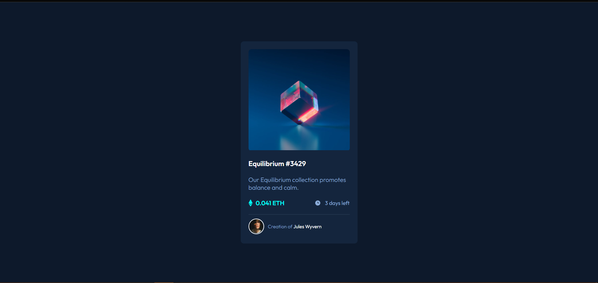
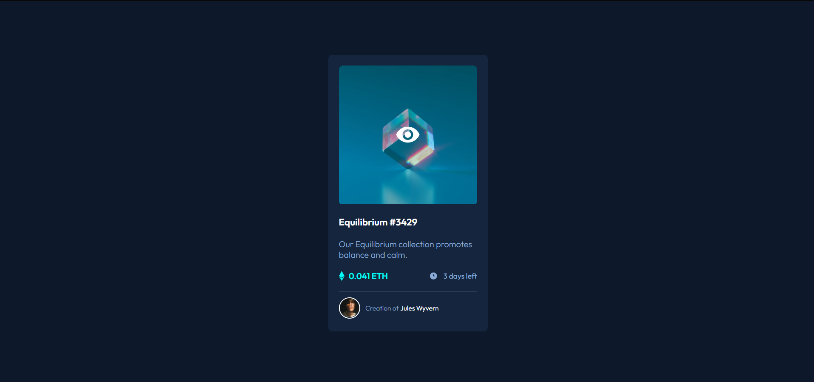
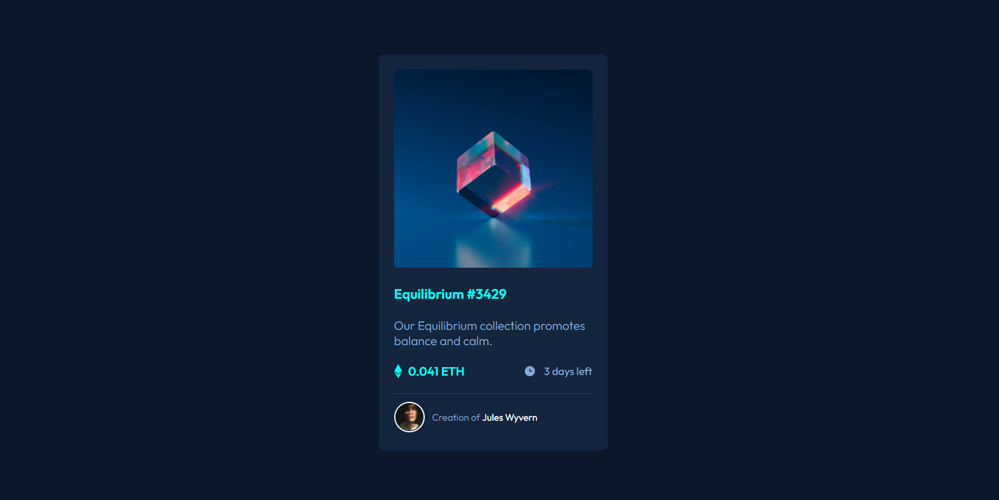
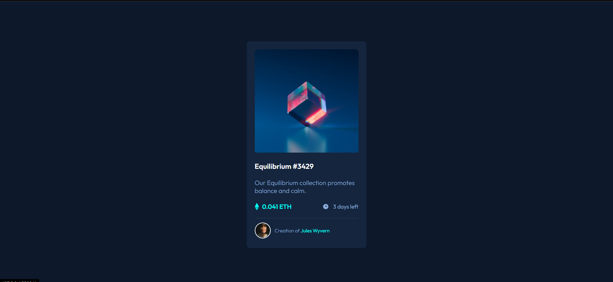

# Frontend Mentor - NFT preview card component solution

This is a solution to the [NFT preview card component challenge on Frontend Mentor](https://www.frontendmentor.io/challenges/nft-preview-card-component-SbdUL_w0U). Frontend Mentor challenges help you improve your coding skills by building realistic projects.

## Table of contents

- [Overview](#overview)
  - [The challenge](#the-challenge)
  - [Screenshot](#screenshot)
  - [Links](#links)
- [My process](#my-process)
  - [Built with](#built-with)
- [Author](#author)
- [Acknowledgments](#acknowledgments)

**Note: Delete this note and update the table of contents based on what sections you keep.**

## Overview

### The challenge

Users should be able to:

- View the optimal layout depending on their device's screen size
- See hover states for interactive elements

### Screenshot

### Links

- Solution URL: [Solution](https://raitoforce.github.io/ntf-preview-card/)
- Live Site URL: [Live Site](https://raitoforce.github.io/ntf-preview-card/)

## My process

I wrote first my html structure whith BEM methodoly to keep it ordered. At the end I only wrote my css BEM classes. Maybe i did some changes on my html structure because I noticed that ::after dont work with img, so I added a wrapper to it.

### Built with

- Semantic HTML5 markup
- CSS custom properties
- Flexbox
- [BEM Methodology](https://en.bem.info/methodology/) - BEM

## Author

- Frontend Mentor - [@Raitoforce](https://www.frontendmentor.io/profile/Raitoforce)
